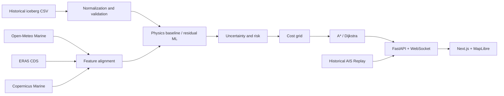

# Architecture

The backend owns normalized schemas, UTC handling, GeoJSON generation, route cost calculation, and provider status. The frontend only renders API contracts and updates MapLibre sources/layers in place. Raw scientific files belong in `data/raw` and are never loaded wholesale into the browser.
